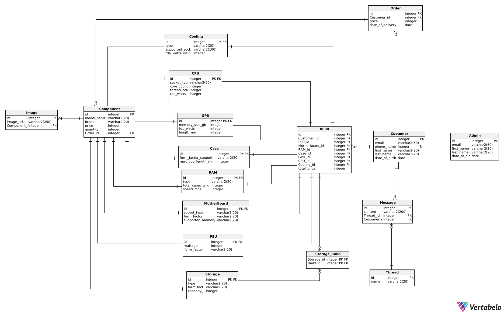
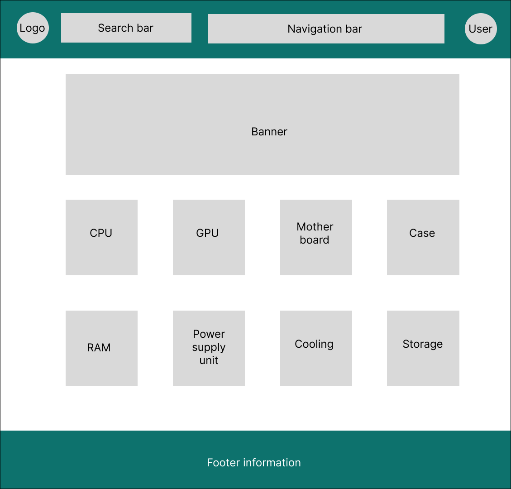
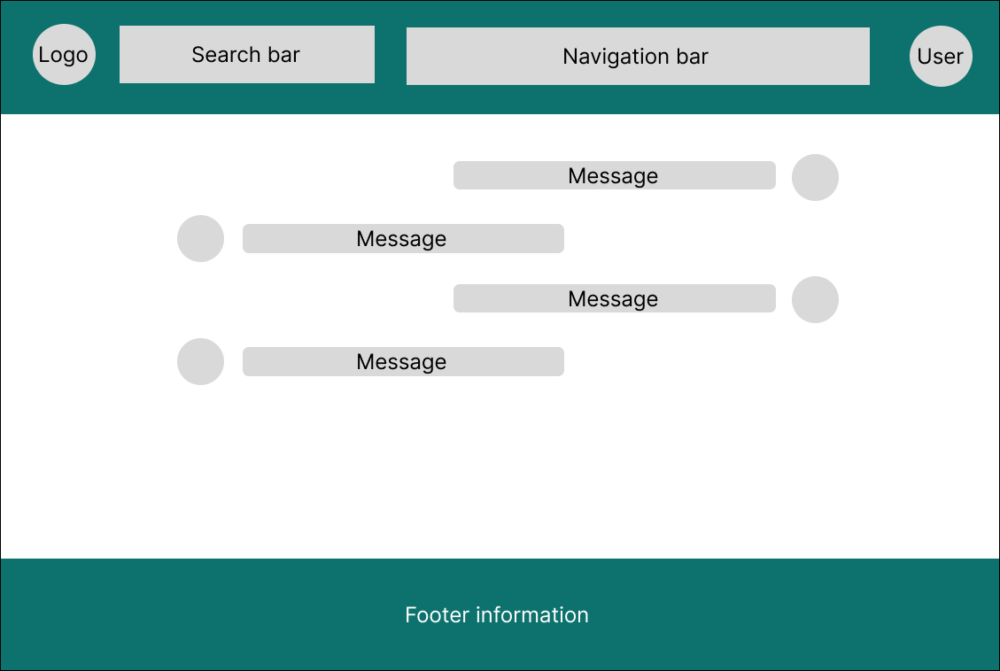

# Custom PC Builder Shop

**Problem area** – this web-application allows PC enthusiasts, small system integrators, IT departments, and just regular users to easily build custom personal computers, where compatibility of each detail is automatically checked, and where users can easily buy those details in one place. It also allows users to discuss certain topics related to builds by using a forum.

## Project goals
- Make user experience of building custom personal computers easier by providing automatic compatibility checks.
- Make user experience of buying personal computers details easier by storing everything in one place.
- Foster a community for discussion, advice, and troubleshooting.

## System responsibilities
-	Maintain a catalog of PC components (CPU, GPU, RAM, Storage, etc.).
-	Enable users to assemble a build from selected parts with live validation.
-	Process orders and payments for builds or individual components.
-	Host a forum for discussions.
-	Provide an admin dashboard for orders, moderation, and statistics.

## System users
- **User** – an abstract class that will hold mutual fields of the Customer and Admin.
- **Customer** – a person, who can build his personal computer, buy the details for it, and discuss certain topics on the forum.
- **Admin** – a person, who manages the threads created on the forums, and the overall web-application.

## Functionalities
- Authentication (registration and login).
-	Topic-based forum where users start threads on builds, troubleshooting, or performance comparisons.
-	Build planner with compatibility checker.
-	Order management (creating, viewing history, tracking status).
-	Favorites and build draft saving.
-	Visual statistics for admins: number of active builds, most popular components, order trends over time, revenue by category, top forum contributors.
-	Email notifications about order updates, forum replies and promotions.

## User requirements
### Part 1: Domain Structure
There are 15 entities. The biggest part of entities are components of the personal computer (each class inherits Component entity to reduce number of repeated fields):
-	Component (id, modelName, brand, price, quantity)
-	CPU (id, socketType, coreCount, threadCount, tdpWatts)
-	GPU (id, memorySizeGb, tdpWatts, lengthMM)
-	Case (id, formFactorSupport, maxGPULengthMM)
-	Cooling (id, type, suuportedSockets, tdpWattsRating)
-	RAM (id, type, totalCapacityGB, speedMHZ)
-	Mother board (id, socketType, formfactor, supportedMemory)
-	PSU (id, wattage, formFactor)
-	Storage (id, type, formfactor, capacityGB)

All of them (except for Storage) have one to many connection to Build entity, but Storage has many to many connection, as Build can have only one CPU, GPU, etc., but can have multiple different storages (for example a couple of SSDs, and HDDs).
As I said previously there are going to be 2 main types of users (Customer and Admin inherit User): 
-	User (id, email, firstName, lastName, dateOfBirth)
-	Customer (phoneNumber)
-	Admin
And additional entities to ensure correct functionality:
-	Order (id, customerId, dateOfDelivery)
-	Build (id, customerId, psuId, motherBoardId, ramId, caseId, gpuId, cpuId, coolingId, totalPrice)
-	Thread (id, name)
-	Message (id, content, threadId, customerId)
Customers can have multiple Builds, Orders, and Messages in Threads. Orders have one to one connection with Builds.

### Part 2: Expected Functionality
Methods used by User:
-	login()
-	logout()
-	register()
Methods used by Customer:
-	createBuild()
-	saveBuild()
-	viewBuildHistory()
-	placeOrder()
Methods used by Admin:
-	manageComponent()
-	viewAnalytics()
-	deleteMessage()
Methods of BuildService:
-	addComponent()
-	removeComponent()
-	validateBuild()
Methods of CompatibilityCheckerService:
-	checkSocket()
-	checkPower()
-	checkDimensions()
Methods of ForumService:
-	createThread()
-	addMessage()

### Part 3: Constraints
-	Scalability: Support 500 concurrent compatibility checks with <200 ms latency.
-	Availability: 99.9% uptime (monthly downtime <44 minutes).
-	Security: All traffic encrypted (HTTPS), OWASP Top 10 mitigations.
-	Data Retention: Store orders and forum posts for ≥5 years.
-	Integrity: ACID transactions for builds and orders.
-	Browser Support: Latest two versions of Chrome, Firefox, Edge.
-	Backup: Nightly backups with point-in-time restore.

## Functional requirements

## Description of the system structure

## Non-functional requirements
Constraint and Metric:
- Response Time: 95% of requests <200 ms
- Uptime: 99.9% per month
- Data Retention: ≥5 years
- Security: OWASP Top 10 mitigated
- Scalability: 500 concurrent checks

## Database schema

## API endpoints list with description
| Method | Endpoint                                      | Description              |
|:-------|:----------------------------------------------:|-------------------------:|
| POST   | `/api/auth/register`                          | Create new user          |
| POST   | `/api/auth/login`                             | Authenticate user        |
| GET    | `/api/components/{type}`                      | List components          |
| GET    | `/api/components/{type}/{id}`                 | Component details        |
| POST   | `/api/builds`                                 | Create build             |
| PUT    | `/api/builds/{id}/components`                 | Add/remove component     |
| GET    | `/api/builds/{id}/validate`                   | Compatibility check      |
| POST   | `/api/orders`                                 | Submit order             |
| GET    | `/api/orders/{customerId}`                    | Get customer orders      |
| GET    | `/api/forum/threads`                          | List threads             |
| POST   | `/api/forum/threads`                          | Create thread            |
| GET    | `/api/forum/threads/{threadId}/messages`      | List messages            |
| POST   | `/api/forum/threads/{threadId}/messages`      | Post message             |

## List of Used Technologies

| Technology                | Purpose                                           |
|:--------------------------|:--------------------------------------------------|
| Java 22 and Spring Boot   | Backend application framework                     |
| Spring MVC                | Backend web framework for routing and controllers |
| Spring Security           | Authentication and authorization                  |
| Spring Data JPA           | ORM for database access                           |
| PostgreSQL                | Relational database                               |
| React                     | Frontend library for building user interfaces     |
| Axios or Fetch API        | HTTP communication between frontend and backend   |
| Gradle                    | Build automation and dependency management        |
| JUnit                     | Unit testing framework for Java                   |
| Git and GitHub            | Version control and collaboration platform        |

## Visualization

